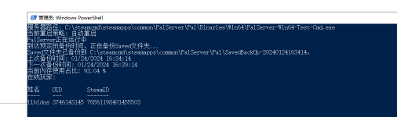

## 一个简单的PalWorld保活脚本，用来解决PalWorld内存溢出问题
#### Feature
- 支持两种重启策略：自动重启（进程不存在即重启） 和 定时重启（每天固定时间重启，或者固定时间间隔重启）
- 展示物理内存用量
- 展示在线用户
- Saved文件夹备份，间隔一段时间备份一次，备份文件夹在Saved同一个级别SavedBackUp里面
- rcon重启通知，在内存占用过高或者服务器即将定时重启时，会发送rcon通知，**需要下载arrcon插件,并添加到系统环境变量Path中**
- 配置一次后，会生成一个配置文件config.cfg，下次启动时会自动读取配置文件，不需要再次配置
#### Q&A
- 为什么执行不了？
    - 语法错误（缺少语句块，etc）：代码是用UTF-8编码保存的，很多Windows版本默认不支持，需要在系统的区域设置打开UTF-8支持（控制面板-时钟和区域-区域-管理-更改系统区域设置-选中Beta版：使用Unicode UTF-8提供全球语言支持）
    - 不允许执行 ： 需要将执行策略改成RemoteSigned,或者Unrestricted 例如：Set-ExecutionPolicy -Scope CurrentUser -ExecutionPolicy Unrestricted -Force
- arrcon连接超时或失败
    - 目前发现PalWorld服务端会出现对RCON命令没有响应的情况，不影响基本功能
- 找不到arrcon
    - 需要下载arrcon程序，并将其路径加到系统环境变量Path里面，这个ARRCON可以在github上搜到
- RCON密码是什么？
  - 是PalWorld服务端的管理员密码，需要在服务端的配置文件里面设置，参数名是AdminPassword
- RCON连接失败
  - 确保服务端的配置文件的RCONEnabled是True，并且端口号是默认的25575

## 示例

## todo

